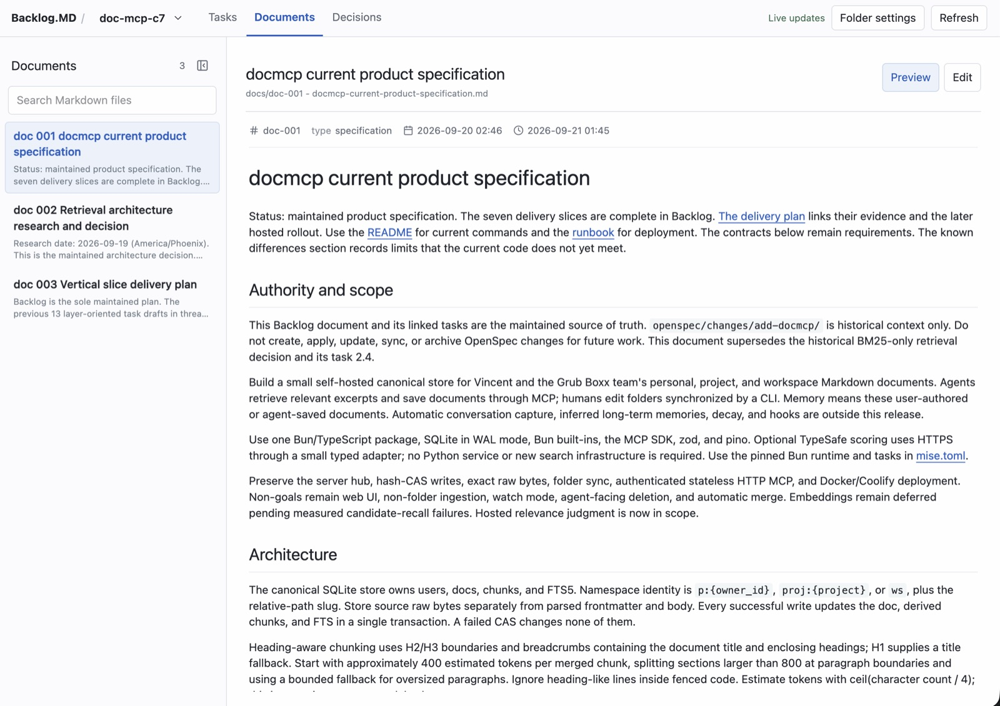
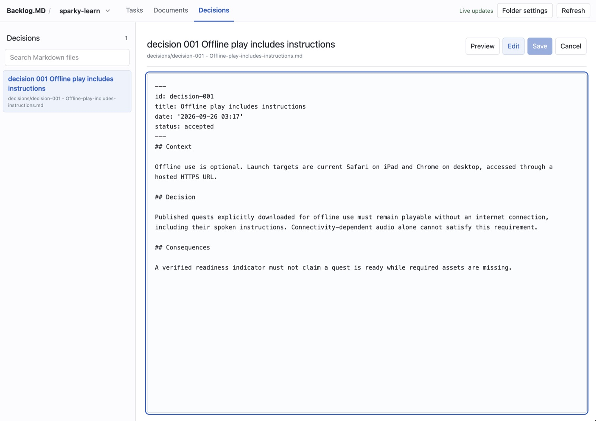

# Backlog.MD

Backlog.MD shows the Backlog.md files of your BB projects inside BB. It gives
you a Kanban board for tasks. It also lets you read and edit the documents and
decisions of each project.

This is an independent BB plugin. It is not affiliated with or endorsed by the
official [Backlog.md project](https://github.com/MrLesk/Backlog.md). We thank
its maintainers and contributors for their work.

## Install

You need BB 0.43 or later, and a BB project with a Backlog.md folder. You do
not need the Backlog CLI or an account.

Open **Plugins** in BB, search for **Backlog.MD**, and install it. You can also
install it from the Git repository:

```sh
bb plugin install 'git:https://github.com/StreamlinedStartup/bb-plugin-backlog.git'
```

## Tasks


Open **Backlog.MD** in the BB navigation. Select a project in the top bar.

- Drag cards between the status lanes, or use Alt and the arrow keys.
- Search, filter, and sort the board.
- Click a task to read it. Double-click a property or a section to edit it.
- Type `@` in the BB composer to mention a task. Read
  [task mentions](docs/task-mentions.md) for details.

## Documents and decisions



The **Documents** and **Decisions** tabs list the Markdown files in `docs/` and
`decisions/`. Select a file to read it. Click **Edit** to change it. The panel
icon in the list header hides the list to give the file more space.



## Add selected text to chat

1. Select text in a task, a document, or a decision.
2. Click the **+** button.
3. BB opens the latest thread of the project, or a new thread draft if the
   project has none. The draft has your text and the path of the file.
4. Add your message and send it. The plugin never sends the message.

## More information

- [Details](docs/details.md): folder selection, file safety, limits, and
  development.
- [MIT license](LICENSE).
