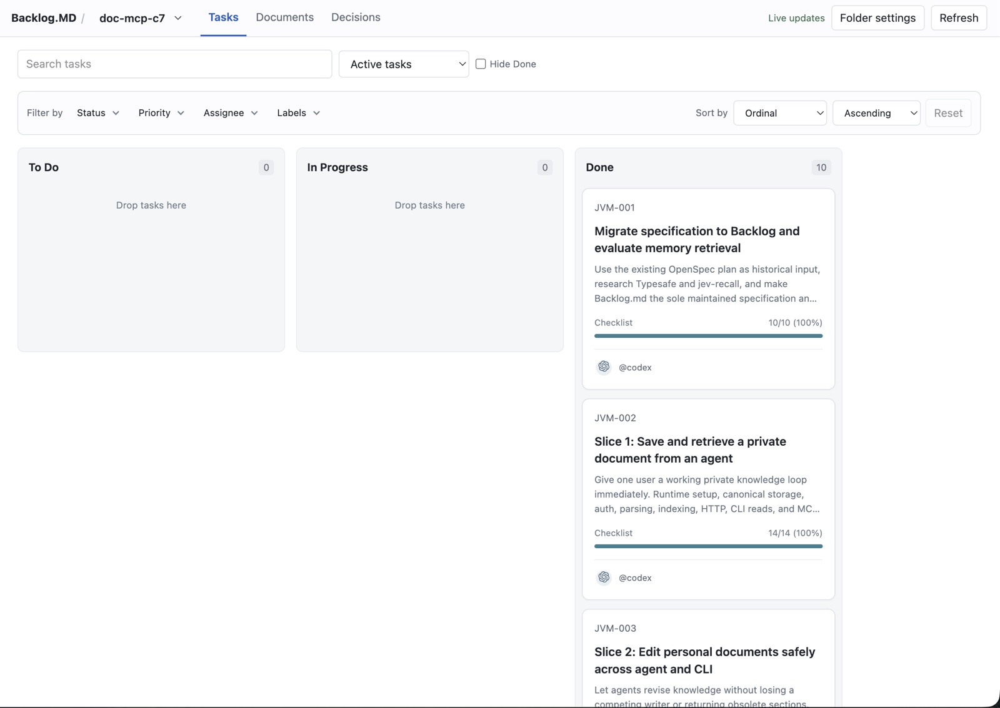
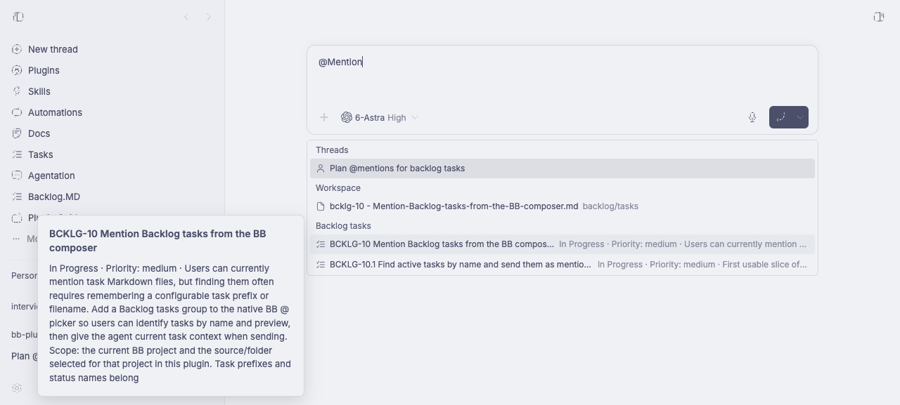

# Backlog.MD

A light-only Backlog.md browser for BB, with a Kanban board for tasks and
Markdown workspaces for project documents and decisions.

This is an independent BB plugin, not affiliated with or endorsed by the
official [Backlog.md project](https://github.com/MrLesk/Backlog.md).
We are grateful to its maintainers and contributors for their work.

## Install

Requires BB 0.43 or later with Plugin SDK 0.5.9 through 0.5.x. Install from
the tagged Git release:

```sh
bb plugin install 'git:https://github.com/StreamlinedStartup/bb-plugin-backlog.git@v0.2.0'
```

The plugin builds from source during installation. No external account, API
key, or Backlog CLI is required. Select a BB project with an existing
[Backlog.md](https://github.com/MrLesk/Backlog.md) task folder. The plugin
reads and edits that folder through BB's enrolled host; it does not create tasks.
It uses experimental BB host and provider APIs. macOS has been tested;
Windows host paths have not been verified.

## Board



Open **Backlog.MD** in BB navigation. The center board shows configured status
lanes, including empty lanes. Every BB project, including Personal, appears
in the right rail. On narrow screens, projects become a horizontal selector.

## Documents and Decisions

Use the left navigation to open **Documents** or **Decisions**. The middle
panel lists Markdown files from `docs/` or `decisions/` in the selected Backlog
folder. Choose a file to read its rendered Markdown in the right panel, or
switch to **Edit** for a quick change. Saves use the file revision to detect
concurrent changes and keep a local draft when a conflict needs review.

Select text in a preview and click the floating **+** button to add it to the
BB chat as a quoted passage. The composer receives focus so you can continue
writing your request. On narrow screens, section navigation, file rows, and the
preview stack vertically.

## Working with tasks

### Mention a task in chat

Type `@` and words from a task's title or description, then choose it under
**Backlog tasks**. You do not need to remember its ID prefix. Suggestions show
the title, ID, status, priority when set, and a short description. Pause over
a suggestion for 1.5 seconds to read a larger preview.



Search uses the current project's selected source and Backlog folder, including
completed and archived tasks. Sending reads the task again so the agent gets
its current content. See [task mentions](docs/task-mentions.md) for keyboard
controls and reference behavior, or read the [v0.2.0 release notes](docs/releases/v0.2.0.md).

### Read and edit tasks

- Cards show a three-line description preview, labels, assignees and checklist progress.
- Drag cards to a lane or before another card to change status or order.
- With a card focused, Alt+Left/Right changes status and Alt+Up/Down changes
  order. Enter opens the task. Cards have no separate move menu.
- Click a task for rendered Markdown with headings, tables, checklists, links,
  and highlighted code. Backlog markers and HTML comments stay in the file
  but are hidden in the preview. Content between markers remains visible.
- The task modal keeps the ID in its header, presents the editable properties
  with compact icons and restrained status colors, and shows created and
  updated timestamps as read-only values. Unknown frontmatter is not exposed
  as a separate identity block.
- Fields start in preview mode. Double-click an editable property or section
  heading to edit it, then explicitly Save or Cancel. Keyboard activation is
  available when the editable property or heading has focus. List values are
  grouped into compact chips, and long paths are shortened with the full value
  available on hover. Field editors open in the property being changed, and
  due dates use a date picker.
- Related subtasks appear as linked rows with status, assignee, and completion
  progress. Explicit parent fields, declared child IDs, and numbered child IDs
  are supported. Acceptance checklists render as structured rows.
- Search across task content. Storage filters distinguish active `tasks/`,
  `completed/`, and `archive/tasks/`. Hide the last configured status using the
  checkbox. Editing an archived task never restores it to active storage.
- Filter by status, priority, assignee, or label. Sort by ordinal, title,
  priority, due date, creation date, or update date, in either direction.

No Backlog CLI is required by the plugin. This repository uses its installed
CLI to track plugin development, according to AGENTS.md.

## Folder selection

For the selected BB project and checkout, resolution uses:

1. A custom folder saved in **Folder settings**.
2. `backlog_directory` in the checkout root `backlog.config.yml`.
3. An existing `backlog/` or `.backlog/` folder.

If both default folders exist, explicitly select one. Viewing a project never
creates a Backlog directory. With multiple BB sources, choose one checkout;
its host ID and source path are remembered with the selection. An offline
host or project without a source stays visible with an explanation.

Folder settings accepts relative or absolute paths, including a folder outside
the checkout. Browse invokes BB on the selected source host. The selected
folder must be a real directory. Task, document, and decision symlinks are
skipped and reported.
Root configuration overrides legacy `config.yml` inside the task folder.
Statuses, priorities, task types, and project classifications are validated
against configuration when edited. Unknown statuses remain visible in their
own lanes so they can be corrected.

## File preservation and concurrent edits

Task Markdown is authoritative. BB storage holds only project selections.
The YAML parser retains source ranges, and writes replace only edited values
or the interior of a supported section. Unknown YAML fields, custom Markdown,
section markers, comment metadata, and line endings are preserved. YAML value
comments remain in the file; comments inside a changed collection may move
next to its replacement value. Anchored values cannot be edited through the UI.

Every write re-reads the file, verifies task identity, compares edited fields
with the original values, and passes the current SHA-256 to BB file writes.
Provably disjoint changes merge. Overlaps show the current file alongside the
user draft. A task changed during a comment edit requires explicit review.
There is no force-overwrite operation. Deleted, malformed, ambiguous, duplicate-ID,
or unverified task inventories cannot be mutated.

Live refresh updates the board and unedited modal fields. Active drafts stay
open on failed saves. Escape cancels an edit before closing a modal. Drafts
are retained in browser session storage and recovered when the task is reopened
in the same browser session. Save or explicit Cancel removes the stored draft.
The browser warns before leaving with an active draft. Closing the entire
browser session may clear session storage.

Ordering uses numeric `ordinal` values. Missing or duplicate lane ordinals are
normalized in existing display order through individual guarded writes, then
the moved card gets a value between its neighbors. If a later write conflicts,
earlier normalization may remain, but it never overwrites a concurrent field
change. Extreme values with no floating-point space produce an explicit error.

Native host watches coalesce file events and publish invalidations through
BB realtime. Five-second reconciliation covers missed events and reconnects.
Idle watches expire within 35 seconds without a board heartbeat; reload,
disable, and host lifecycle disposal close their subscriptions. Multiple windows
can share one project watch. The plugin never runs task hooks or Git commands.

## Format and limits

Verified against Backlog.md CLI 1.52.0 and upstream revision
`aded8e254e6a0205b878cf07e631d1a592782040` (2026-09-17).

Editable frontmatter: title, status, type, priority, assignee, reporter, labels,
milestone, due date, project, dependencies, references, documentation, and
modified files. Identity and derived fields remain read-only.

Supported body sections: Description, Acceptance Criteria, Definition of Done,
Implementation Plan, Implementation Notes, Final Summary, and individual
Comments. Standard section sentinels and legacy known headings are read for task sections. Individual comment editing requires Backlog comment markers.
Comment author/date/index metadata is preserved. Custom sections remain visible
in the complete preview; edit them directly with your project tooling.

Bounds are 512 KiB per Markdown file, 5 MiB of board task text, 3000 task files,
1000 documents and 1000 decisions, 100 directories, and 16 directory levels.
Task scan-limit warnings block task writes to avoid unsafe identity assumptions;
document and decision scan warnings are shown in their file browser.
Remote images are represented by their alt text; raw HTML is not executed. Code
examples remain code. POSIX host paths are supported; Windows-host paths have
not been verified. Standalone Plans are not currently listed as a separate view;
task implementation plans work in the task board.

Task creation, deletion, archive/restore, CLI execution, Git actions, and status
hooks are outside this version.

## Development

The project pins pnpm 12.4.2 for dependencies, Bun 1.4.2 for tests and scripts,
and SDK 0.5.9. BB supplies React at runtime; test dependencies provide React
locally. See [dependency management](docs/development.md).

```sh
mise install
mise run install
mise run test
mise run typecheck
mise run build
bb plugin install . --yes
```

Start the long-lived development watcher in a named session:

```sh
tmux new-session -d -s backlog-dev 'mise run dev'
```

`mise run verify-live` tests the installed plugin with temporary fixtures under
`.test-results/`. It temporarily changes this project selection and restores it
in a `finally` block. Do not run it while editing a task in the project UI.
The JSON report includes discovery, storage, guarded writes, conflict recovery,
and native watch signal latency.

BB downloads a pinned build toolchain on the first build. For a sandbox, set
`MISE_DATA_DIR`, `MISE_CACHE_DIR`, and `MISE_STATE_DIR` to writable directories.
An isolated `BB_DATA_DIR` can hold the build toolchain. Local verification used
Bun to install the exact toolchain dependencies instead of its npm bootstrap.

## Verification and troubleshooting

Tests cover format preservation, Markdown safety, drafts, discovery, ordering,
watcher lifecycle, task identity, and concurrent writes. Live checks exercise
BB RPC and the enrolled local daemon. A separate remote machine is unavailable
here; remote routing is verified at the SDK contract boundary only.

If tasks are missing, check Folder settings and the source host, then read the
warning. Runtime logs are available through `bb plugin logs backlog`.

Assignee badges recognize Codex and Claude (including Claude Code) and use BB provider artwork at a compact size. Other assignees display their first two letters.

## License

[MIT](LICENSE).
